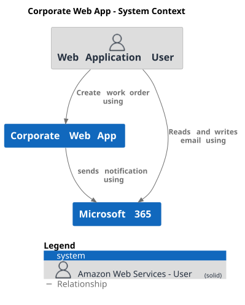
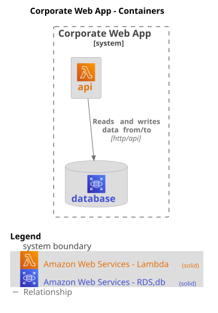

# Structurizr for the `buildzr`s 🧱⚒️

[](https://github.com/amirulmenjeni/buildzr/actions/workflows/build.yml)
[](https://pypi.org/project/buildzr/)
[](https://pypi.org/project/buildzr/)

`buildzr` is a [Structurizr](https://structurizr.com/) authoring tool for Python programmers. It allows you to declaratively or procedurally author Structurizr models and diagrams.

If you're not familiar with Structurizr, it is both an open standard (see [Structurizr JSON schema](https://github.com/structurizr/json)) and a [set of tools](https://docs.structurizr.com/usage) for building software architecture diagrams as code. Structurizr derives its architecture modeling paradigm based on the [C4 model](https://c4model.com/), the modeling language for describing software architectures and their relationships.

In Structurizr, you define architecture models and their relationships first. And then, you can re-use the models to present multiple perspectives, views, and stories about your architecture.

`buildzr` supercharges this workflow with Pythonic syntax sugar and intuitive APIs that make modeling as code more fun and productive.

## Install

```bash
pip install buildzr
```

## Quick Example

```python
from buildzr.dsl import (
    Workspace,
    SoftwareSystem,
    Person,
    Container,
    SystemContextView,
    ContainerView,
    desc,
    Group,
    StyleElements,
)
from buildzr.themes import AWS

with Workspace('w') as w:

    # Define your models (architecture elements and their relationships).

    with Group("My Company") as my_company:
        u = Person('Web Application User')
        webapp = SoftwareSystem('Corporate Web App')
        with webapp:
            database = Container('database')
            api = Container('api')
            api >> ("Reads and writes data from/to", "http/api") >> database
    with Group("Microsoft") as microsoft:
        email_system = SoftwareSystem('Microsoft 365')

    u >> [
        desc("Reads and writes email using") >> email_system,
        desc("Create work order using") >> webapp,
    ]
    webapp >> "sends notification using" >> email_system

    # Define the views.

    SystemContextView(
        software_system_selector=webapp,
        key='web_app_system_context_00',
        description="Web App System Context",
        auto_layout='lr',
    )

    ContainerView(
        software_system_selector=webapp,
        key='web_app_container_view_00',
        auto_layout='lr',
        description="Web App Container View",
    )

    # Stylize the views, and apply AWS theme icons.

    StyleElements(on=[u], **AWS.USER)
    StyleElements(on=[api], **AWS.LAMBDA)
    StyleElements(on=[database], **AWS.RDS)

    # Export to JSON, PlantUML, or SVG.

    w.save()                                  # JSON to {workspace_name}.json

    # Requires `pip install buildzr[export-plantuml]`
    w.save(format='plantuml', path='output/') # PlantUML files
    w.save(format='svg', path='output/')      # SVG files
```




## Getting Started

Ready to dive in? Check out the [Quick Start Tutorial](https://buildzr.dev/getting-started/quick-start/) and [User Guides](https://buildzr.dev/user-guide/core-concepts/).

## Why use `buildzr`?

✅ **Intuitive Pythonic Syntax**: Use Python's context managers (`with` statements) to create nested structures that naturally mirror your architecture's hierarchy. See the [example](#quick-example).

✅ **Programmatic Creation**: Use `buildzr`'s DSL APIs to programmatically create C4 model architecture diagrams. Great for automation!

✅ **Advanced Styling**: Style elements beyond just tags --- target by direct reference, type, group membership, or custom predicates for fine-grained visual control. Just take a look at [Styles](https://buildzr.dev/user-guide/styles/)!

✅ **Cloud Provider Themes**: Add AWS, Azure, Google Cloud, Kubernetes, and Oracle Cloud icons to your diagrams with IDE-discoverable constants. No more memorizing tag strings! See [Themes](https://buildzr.dev/user-guide/themes/).

✅ **Type Safety**: Write Structurizr diagrams more securely with extensive type hints and [Mypy](https://mypy-lang.org) support.

✅ **Standards Compliant**: Stays true to the [Structurizr JSON schema](https://github.com/structurizr/json) standards. `buildzr` uses [datamodel-code-generator](https://github.com/koxudaxi/datamodel-code-generator) to automatically generate the low-level representation of the Workspace model.

✅ **Rich Toolchain**: Uses the familiar Python programming language and its rich toolchains to write software architecture models and diagrams!


## Project Links

- [GitHub Repository](https://github.com/amirulmenjeni/buildzr)
- [Issue Tracker](https://github.com/amirulmenjeni/buildzr/issues)
- [Roadmap](https://buildzr.dev/roadmap/)
- [Contributing Guide](https://buildzr.dev/contributing/)