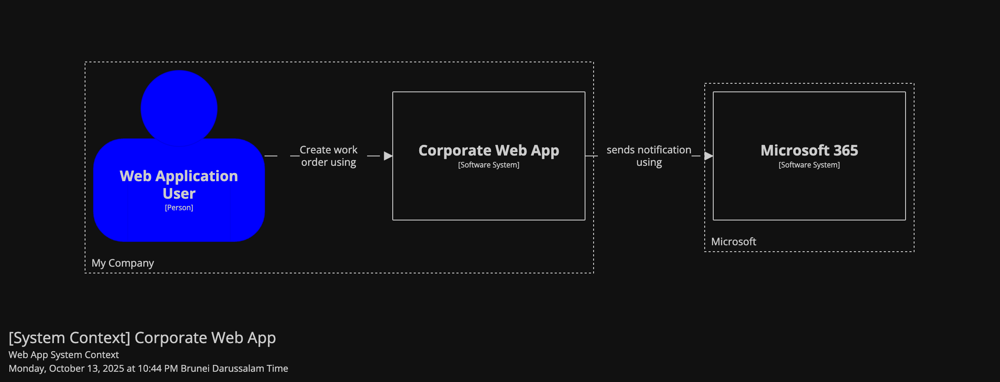
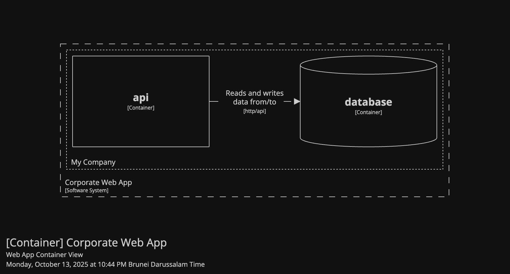

--8<-- "README.md:1:85"

--8<-- "README.md:89:115"

<!-- Override README links with docs-relative paths -->
[Quick Start Tutorial]: getting-started/quick-start.md
[User Guides]: user-guide/core-concepts.md
[Styles]: user-guide/styles.md
[Themes]: user-guide/themes.md
[Roadmap]: roadmap.md
[Contributing Guide]: contributing.md