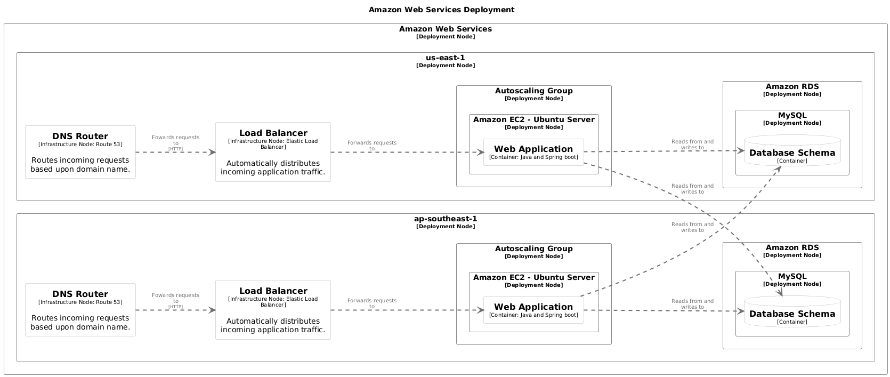
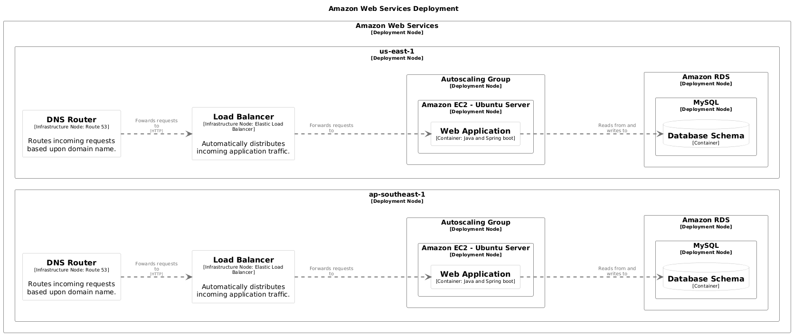

# Models

Models are the fundamental building blocks of your architecture documentation in `buildzr`. They represent the different elements that make up your software system, from high-level abstractions like people and systems down to specific implementation details like components and deployment infrastructure. `buildzr` provides full support for all core C4 model element types, enabling you to create comprehensive architecture diagrams at multiple levels of detail.

## Understanding Model Categories

Your architecture models can be divided into two distinct categories: _static models_ and _instance models_.

**Static models** define the logical architecture of your system --- the abstract concepts, relationships, and structure of your software independent of any specific deployment. These include people who interact with the system, the software systems themselves, and their internal structure broken down into containers and components. Static models answer questions like "What systems exist?" and "How are they organized?"

**Instance models** describe the physical deployment and runtime manifestation of your static models. They represent where and how your software actually runs in the real world --- deployment environments, infrastructure nodes, and specific instances of containers deployed to those nodes. Instance models answer questions like "Where does this run?" and "What infrastructure supports it?"

This separation allows you to define your architecture once as static models, then map those same containers and systems to different deployment scenarios (development, staging, production) without duplicating the core architectural definitions.

Static models:

- `Person`
- `SoftwareSystem`
- `Container`
- `Component`

Instance models:

- `DeploymentEnvironment`
- `DeploymentNode`
- `SoftwareSystemInstance`
- `ContainerInstance`
- `InfrastructureNode`

To walk you through the models, let's use Structurizr's [Amazon Web Services example](https://structurizr.com/dsl?example=amazon-web-services
).

## Person

`Person` represents human users, actors, roles, or personas.

```python
user = Person("User", description="An ordinary user.")
```

## Software System

`SoftwareSystem` represents the highest level of abstraction. A software system may contain zero or more containers.

```python
with SoftwareSystem('X') as x:
    # Its containers goes here.
    ...
```

## Container

`Container` represents an application, data store, or service within a software system. A container may contain zero or more components.

Here, we define the containers inside the software system `x` we've defined above.

```python
with SoftwareSystem("X") as x:

    wa = Container("Web Application", technology="Java and Spring boot")

    db = Container("Database Schema")

    wa >> "Reads from and writes to" >> db
```

Notice that we've also described a relationship between the web application `wa` and the database `db` of the software system `x`.

## Component

`Component` represents a component within a container.

The `wa` web application may further be comprised of several layers, each serving different purpose. For example, in an Onion Architecture, your web application might have an API layer that listens for HTTP requests, which may in turn run queries or transactions via the database layer.

```python hl_lines="9-13"
with SoftwareSystem("X") as x:

    wa = Container("Web Application", technology="Java and Spring boot")

    db = Container("Database Schema")

    wa >> "Reads from and writes to" >> db

    with wa:
        api_layer = Component("API Layer")
        db_layer = Component("Database Layer")

        api_layer >> "Runs queries/transactions on" >> db_layer
```

## Properties and Metadata

You can add properties to enrich your models with metadata.

```python
system = SoftwareSystem(
    'System',
    properties={
        'Owner': 'Platform Team',
        'Cost Center': 'IT-001',
        'SLA': '99.9%'
    }
)
```

## Tags

Models can also be assigned tags.

```python
critical_system = SoftwareSystem(
    'Payment System',
    tags=['critical', 'pci-compliant', 'monitored']
)
```

In Structurizr, the purpose of tags are used primarily for styling and visual representation of elements. For example, if an element is tagged as `critical`, you can apply a specific style (e.g., red colored background) to all elements tagged as `critical`.

`buildzr` offer a more flexible styling syntax beyond tagging. See [Styles](./styles.md).

!!! note
    If you run the code above, you will see that the `critical_system` has some extra additional "hidden" tags: `Element` and `SoftwareSystem`. By default, each model element will have default tags assigned to them: the model type (`Relationship` or `Element`) and, if it's an `Element`, the type of the element (e.g., `SoftwareSystem`, `Person`, `Container`, or `Component`).

## Deployment Elements

Now that we've defined the static models, let's detail out our architecture further by modeling how they're meant to be run or hosted.

### Deployment Environment

`DeploymentEnvironment` defines a deployment context (e.g., Development, Staging, Production). Each environment can have its own set of deployment nodes and infrastructure.

```python
with DeploymentEnvironment('Production') as prod:
    # Define deployment nodes
    pass
```

### Deployment Node

`DeploymentNode` represents infrastructure or runtime environment where your containers are deployed. Deployment nodes can be nested to represent hierarchical infrastructure (e.g., cloud provider → region → cluster → instance).

```python
with SoftwareSystem('Web Application') as system:
    api = Container(
        'API',
        description='Provides REST API',
        technology='Python/FastAPI'
    )

with DeploymentEnvironment('Production') as prod:
    with DeploymentNode('AWS'):
        with DeploymentNode('EC2', technology='Ubuntu 22.04'):
            # Deploy containers
            api_instance = ContainerInstance(api)
```

### Infrastructure Node

`InfrastructureNode` represents supporting infrastructure components that don't host containers but are essential to your system (load balancers, message queues, caches, etc.).

```python
with DeploymentNode('AWS'):
    load_balancer = InfrastructureNode(
        'Load Balancer',
        description='Distributes traffic',
        technology='AWS ELB'
    )
```

### Deployment Group

`DeploymentGroup` allows us to group deployment instances together so relationships only exist between instances sharing the same deployment group, enabling isolated multi-instance deployments like multi-tenant or blue-green scenarios.

In this example, we'll use `DeploymentGroup` to isolate instance relationships within their respective region (`ap-southeast-1` and `us-east-1`).

```python hl_lines="15 27-28 52 54 81 85"
with Workspace(
    "Amazon Web Services Example",
    description="An example AWS deployment architecture",
) as w:

    user = Person("User", description="An ordinary user.")

    with SoftwareSystem("X") as x:

        # Notice that we don't need to specify the tags "Application" and "Database"
        # for styling -- just pass the `wa` and `db` variables directly to the `StyleElements` class.
        wa = Container("Web Application", technology="Java and Spring boot")
        db = Container("Database Schema")

        wa >> "Reads from and writes to" >> db

        with wa:
            api_layer = Component("API Layer")
            db_layer = Component("Database Layer")

            api_layer >> "Runs queries/transactions on" >> db_layer

    user >> ("Uses", "browser") >> x

    with DeploymentEnvironment("Live") as live:

        dg_region_1 = DeploymentGroup("region-1")
        dg_region_2 = DeploymentGroup("region-2")

        with DeploymentNode("Amazon Web Services") as aws:
            aws.add_tags("Amazon Web Services - Cloud")

            with DeploymentNode("ap-southeast-1") as region_ap_southeast_1:
                region_ap_southeast_1.add_tags("Amazon Web Services - Region")

                dns = InfrastructureNode(
                    "DNS Router",
                    description="Routes incoming requests based upon domain name.",
                    technology="Route 53",
                    tags={"Amazon Web Services - Route 53"}
                )

                lb = InfrastructureNode(
                    "Load Balancer",
                    description="Automatically distributes incoming application traffic.",
                    technology="Elastic Load Balancer",
                    tags={"Amazon Web Services - Elastic Load Balancer"}
                )

                dns >> ("Fowards requests to", "HTTP") >> lb

                with DeploymentNode("Autoscaling Group", tags={"Amazon Web Services - Autoscaling Group"}) as asg:
                    with DeploymentNode("Amazon EC2 - Ubuntu Server", tags={"Amazon Web Services - EC2 Instance"}):
                        lb >> "Forwards requests to" >> ContainerInstance(wa, deployment_groups=[dg_region_1])

                with DeploymentNode("Amazon RDS", tags={"Amazon Web Services - RDS Instance"}) as rds:
                    with DeploymentNode("MySQL", tags={"Amazon Web Services - RDS MySQL instance"}):
                        database_instance = ContainerInstance(db, deployment_groups=[dg_region_1])

            with DeploymentNode("us-east-1") as region_us_east_1:
                region_us_east_1.add_tags("Amazon Web Services - Region")

                dns = InfrastructureNode(
                    "DNS Router",
                    description="Routes incoming requests based upon domain name.",
                    technology="Route 53",
                    tags={"Amazon Web Services - Route 53"}
                )

                lb = InfrastructureNode(
                    "Load Balancer",
                    description="Automatically distributes incoming application traffic.",
                    technology="Elastic Load Balancer",
                    tags={"Amazon Web Services - Elastic Load Balancer"}
                )

                dns >> ("Fowards requests to", "HTTP") >> lb

                with DeploymentNode("Autoscaling Group", tags={"Amazon Web Services - Autoscaling Group"}) as asg:
                    with DeploymentNode("Amazon EC2 - Ubuntu Server", tags={"Amazon Web Services - EC2 Instance"}):
                        lb >> "Forwards requests to" >> ContainerInstance(wa, deployment_groups=[dg_region_2])

                with DeploymentNode("Amazon RDS", tags={"Amazon Web Services - RDS Instance"}) as rds:
                    with DeploymentNode("MySQL", tags={"Amazon Web Services - RDS MySQL instance"}):
                        database_instance = ContainerInstance(db, deployment_groups=[dg_region_2])
```

!!! tip "Deployment Groups Use Case"

    In this example, `DeploymentGroup` ensures that the web app on `ap-southeast-1` (with deployment group `region-1`) only connects to the database in the same region. Likewise, the deployment group `region-2` ensures that the web app in `us-east-1` region only connects to the database in the same region.

    In effect, `DeploymentGroup` allows us to specify the relationship boundary of `SoftwareInstance`s or `ContainerInstance`s.

    Without specifying `DeploymentGroup`, `SoftwareInstance`s or `ContainerInstance`s will share the same `default` deployment group. Since all instances across all regions share the same `default` deployment group, the web app in the first region would look like it is connecting to the database in the second region, and vice versa. Which is not something we'd want.

Without deployment group, we'd have something like this (rendered with PlantUML):



However, if we specify the deployment group like we did in the example above, we avoid drawing a relationship between instances across the region:



## Complete Example

!!! note
    We've added a `SystemContextView` and a `DeploymentView` in the code below, so that the generated JSON output can be used in a rendering tool (e.g., on [https://structurizr.com/json](https://structurizr.com/json)).

    So far, we've only discussed models. With views, we can use (and re-use!) our static and instance models to draw architecture diagrams. See [Views](views.md) for more info.

```python
from buildzr.dsl import (
    Workspace,
    Person,
    SoftwareSystem,
    Container,
    Component,
    DeploymentEnvironment,
    DeploymentGroup,
    DeploymentNode,
    InfrastructureNode,
    ContainerInstance,
    SystemContextView,
    DeploymentView,
    StyleElements,
)

with Workspace(
    "Amazon Web Services Example",
    description="An example AWS deployment architecture",
) as w:

    user = Person("User", description="An ordinary user.")

    with SoftwareSystem("X") as x:

        # Notice that we don't need to specify the tags "Application" and "Database"
        # for styling -- just pass the `wa` and `db` variables directly to the `StyleElements` class.
        wa = Container("Web Application", technology="Java and Spring boot")
        db = Container("Database Schema")

        wa >> "Reads from and writes to" >> db

        with wa:
            api_layer = Component("API Layer")
            db_layer = Component("Database Layer")

            api_layer >> "Runs queries/transactions on" >> db_layer

    user >> ("Uses", "browser") >> x

    with DeploymentEnvironment("Live") as live:

        dg_region_1 = DeploymentGroup("region-1")
        dg_region_2 = DeploymentGroup("region-2")

        with DeploymentNode("Amazon Web Services") as aws:
            aws.add_tags("Amazon Web Services - Cloud")

            with DeploymentNode("ap-southeast-1") as region_ap_southeast_1:
                region_ap_southeast_1.add_tags("Amazon Web Services - Region")

                dns = InfrastructureNode(
                    "DNS Router",
                    description="Routes incoming requests based upon domain name.",
                    technology="Route 53",
                    tags={"Amazon Web Services - Route 53"}
                )

                lb = InfrastructureNode(
                    "Load Balancer",
                    description="Automatically distributes incoming application traffic.",
                    technology="Elastic Load Balancer",
                    tags={"Amazon Web Services - Elastic Load Balancer"}
                )

                dns >> ("Fowards requests to", "HTTP") >> lb

                with DeploymentNode("Autoscaling Group", tags={"Amazon Web Services - Autoscaling Group"}) as asg:
                    with DeploymentNode("Amazon EC2 - Ubuntu Server", tags={"Amazon Web Services - EC2 Instance"}):
                        lb >> "Forwards requests to" >> ContainerInstance(wa, deployment_groups=[dg_region_1])

                with DeploymentNode("Amazon RDS", tags={"Amazon Web Services - RDS Instance"}) as rds:
                    with DeploymentNode("MySQL", tags={"Amazon Web Services - RDS MySQL instance"}):
                        database_instance = ContainerInstance(db, deployment_groups=[dg_region_1])

            with DeploymentNode("us-east-1") as region_us_east_1:
                region_us_east_1.add_tags("Amazon Web Services - Region")

                dns = InfrastructureNode(
                    "DNS Router",
                    description="Routes incoming requests based upon domain name.",
                    technology="Route 53",
                    tags={"Amazon Web Services - Route 53"}
                )

                lb = InfrastructureNode(
                    "Load Balancer",
                    description="Automatically distributes incoming application traffic.",
                    technology="Elastic Load Balancer",
                    tags={"Amazon Web Services - Elastic Load Balancer"}
                )

                dns >> ("Fowards requests to", "HTTP") >> lb

                with DeploymentNode("Autoscaling Group", tags={"Amazon Web Services - Autoscaling Group"}) as asg:
                    with DeploymentNode("Amazon EC2 - Ubuntu Server", tags={"Amazon Web Services - EC2 Instance"}):
                        lb >> "Forwards requests to" >> ContainerInstance(wa, deployment_groups=[dg_region_2])

                with DeploymentNode("Amazon RDS", tags={"Amazon Web Services - RDS Instance"}) as rds:
                    with DeploymentNode("MySQL", tags={"Amazon Web Services - RDS MySQL instance"}):
                        database_instance = ContainerInstance(db, deployment_groups=[dg_region_2])

    SystemContextView(
        software_system_selector=x,
        key='x_context_00',
        description="System context of X",
    )

    DeploymentView(
        environment=live,
        key='aws-deployment-view',
        software_system_selector=x,
        title="Amazon Web Services Deployment",
        description="Deployment view of the web application on AWS",
        auto_layout='lr',
    )

    StyleElements(on=['Element'], background='#ffffff')
    StyleElements(on=['Container'], background='#ffffff')
    StyleElements(on=[wa], background='#ffffff')
    StyleElements(on=[user], shape='Person')
    StyleElements(on=[db], shape='Cylinder')

    w.to_json('workspace.json', pretty=True)
```

## See Also

- [Relationships](relationships.md)
- [Views](views.md)